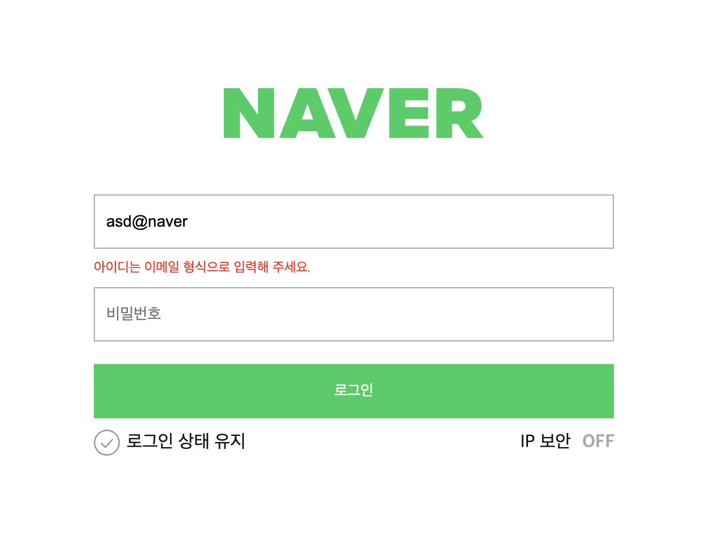
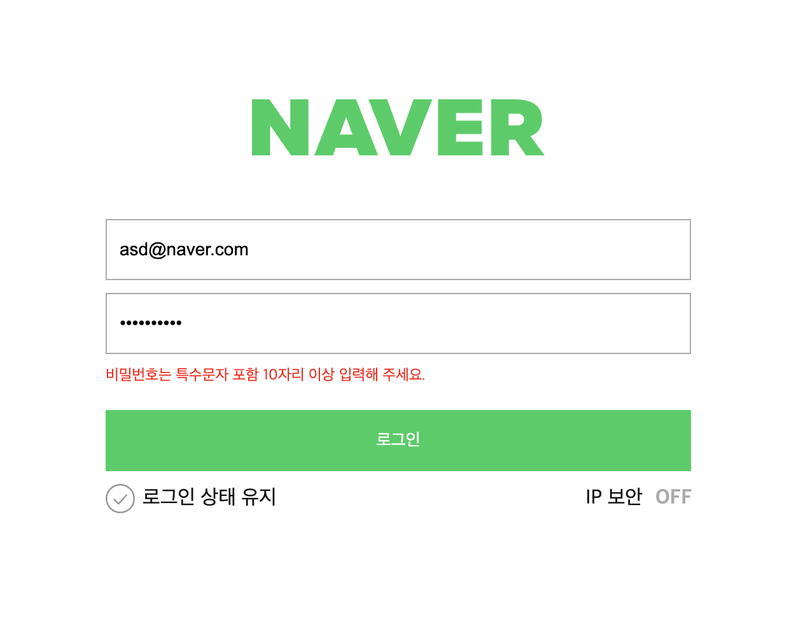
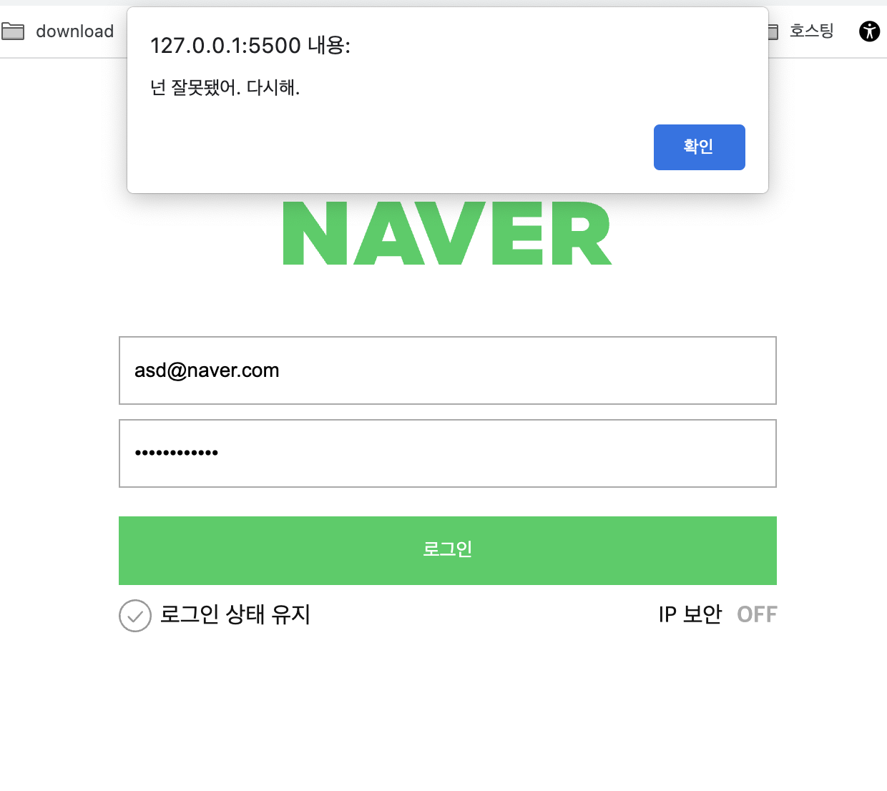

# 네이버 로그인 페이지 구현


---

로그인과 비밀번호를 정확히 입력했을 때 welcome 페이지로 넘어갈 수 있도록 코드 로직을 작성합니다.


---
- [x] 재사용 가능한 함수를 분리하고 함수를 중심으로 설계하는 방법에 대해 학습합니다.


---

```js

function naverLoginId(loginId) {

  // 이메일 유효성 검사 validation
  if (!emailReg(loginId.value)){
    // 통과가 안되면 실행
    loginId.classList.add('is--invalid');
    return;
  }else {
    loginId.classList.remove('is--invalid');
    return true;
  }
}
```
이메일 유효성 검사, 'emailReg'조건이 통과가 안되면 'is--invalid'실행

</br>

```js

function naverLoginPw(loginPw) {

  // 비밀번호 유효성 검사 validation
  if (!pwReg(loginPw.value)){
    // 통과가 안되면 실행
    loginPw.classList.add('is--invalid');
    return;
    // 통과가 되면 
  }else {
    loginPw.classList.remove('is--invalid');
    return true;
  }
}
```
비밀번호 유효성 검사, 'pwReg'조건이 통과가 안되면 'is--invalid'실행
</br>

```js

function naverLoginBtn(loginId, loginPw) {

  const user = {
    id:'asd@naver.com',
    pw:'spdlqj123!@'
  }

  // 유효성 통과한 값과, 지정된 값을 비교
  if (loginId.value === user.id && loginPw.value === user.pw) {
    // true가 나오면 페이지 이동
    window.location.href = 'welcome.html'
    // false일 경우 alert 띄움
  }else if (loginId.value === user.id || loginPw.value === user.pw){
    alert( '넌 잘못됐어. 다시해.' );
  }
}
```
이메일, 비밀번호가 'user'값과 일치했을 경우 다음페이지로 이동,
둘 중 한개의 값이라도 일치하지 않을 경우 alert창 띄우기
</br>

---

<!-- Quote -->
## 결과화면

<!-- Image -->
###### 조건에 맞지않는 아이디 입력


###### 조건에 맞지않는 비밀번호 입력


###### emailReg와 pwReg 조건에는 맞지만 user값과 일치하지않을 때


###### 모든 조건 통과


